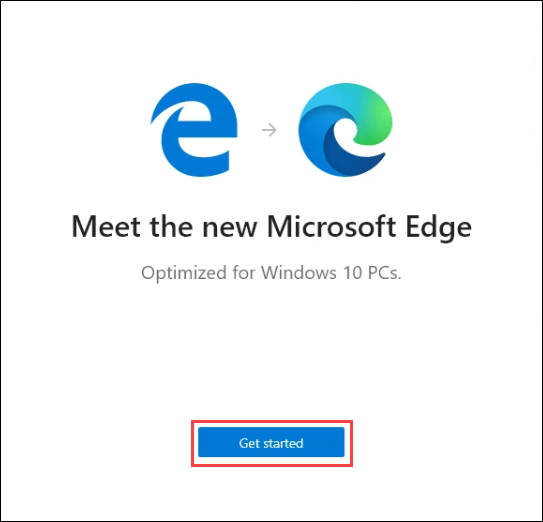

# Getting Started with Azure 

Duration: 10 mins

## Instructions

1. Once the environment is provisioned, a virtual machine (JumpVM) and lab guide will get loaded in your browser. Use this virtual machine throughout the workshop to perform the lab.

   

2. To get the lab environment details, you can select the **Environment Details** tab. Additionally, the credentials will also be sent to your email address provided during registration. Use the given username and password during sign-in.

   

3. You can also open the JumpVM and Lab Guide on Separate full window by selecting the **Split-Window** at the bottom right corner as shown in the above screenshot.

## Login to Azure Portal

1. Lets start by logging into the Azure Portal to check the resources deployed for the lab environment. In the JumpVM on the left, click on the Azure portal shortcut of Microsoft Edge browser which is available on the desktop.

2. When you click on Azure portal, the edge browser welcome screen will pop up, select **Get started**.

   

3. On the next window, click on **Confirm**.

   

4. You can close the popup which is shown below.

   

5. Now, you will see two tabs in the edge browser, close the first tab named **Microsoft Edge** to move to the other tab.

   

6. On the **Sign into Microsoft Azure** tab, you will see the login screen, enter the following username, and, then click on **Next**.

   * Email/Username: <inject key="AzureAdUserEmail"></inject>

   

7. Now enter the following password and click on **Sign in**. 

   * Password: <inject key="AzureAdUserPassword"></inject>

   

8. If you see the pop-up **Stay Signed in?**, click on No

9. If you see the pop-up **You have free Azure Advisor recommendations!**, close the window to continue the lab.

10. If a **Welcome to Microsoft Azure** popup window appears, click **Maybe Later** to skip the tour.

11. Click on **Next** to proceed with the lab.
  
